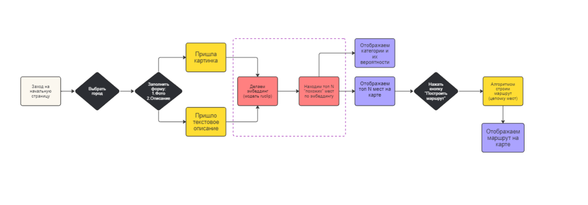
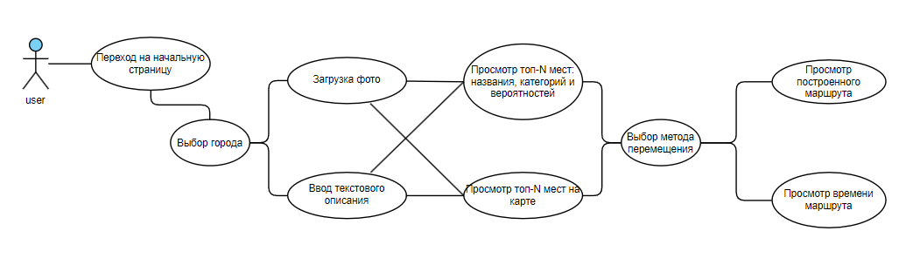
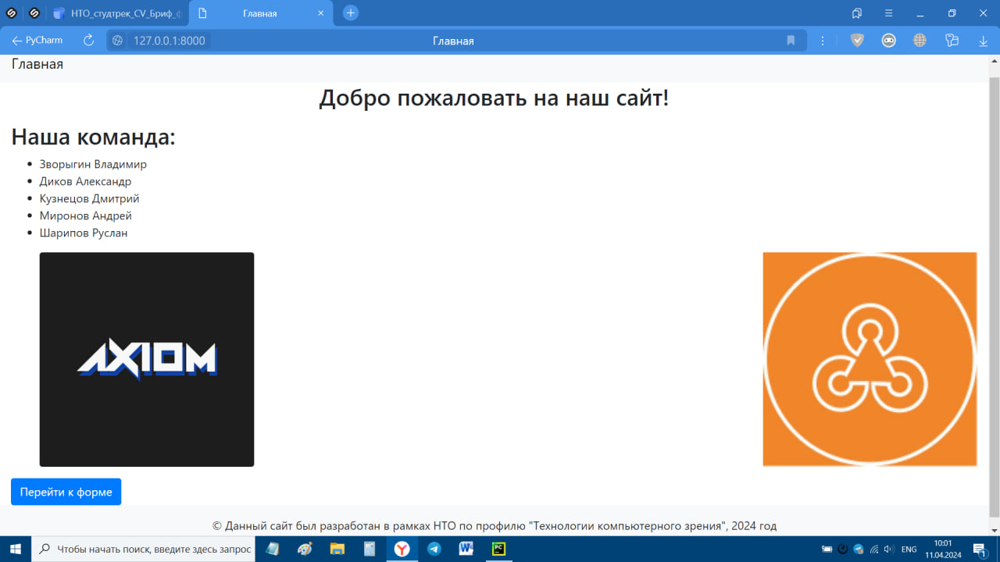
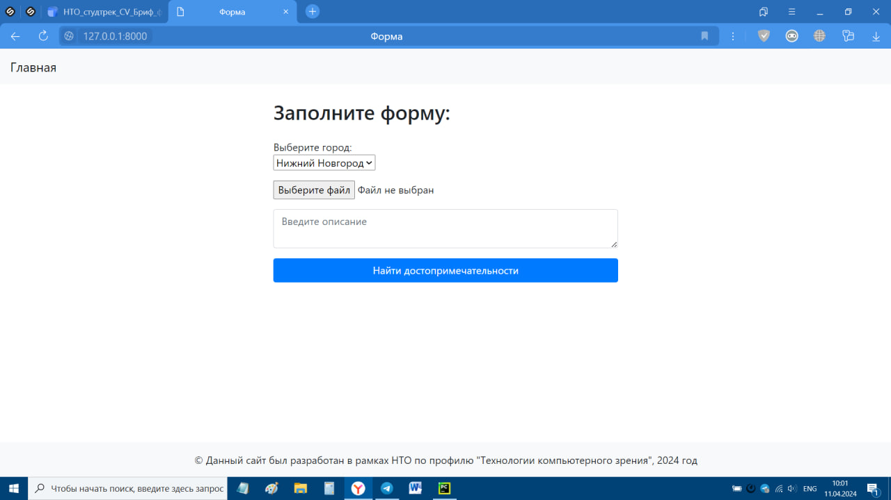
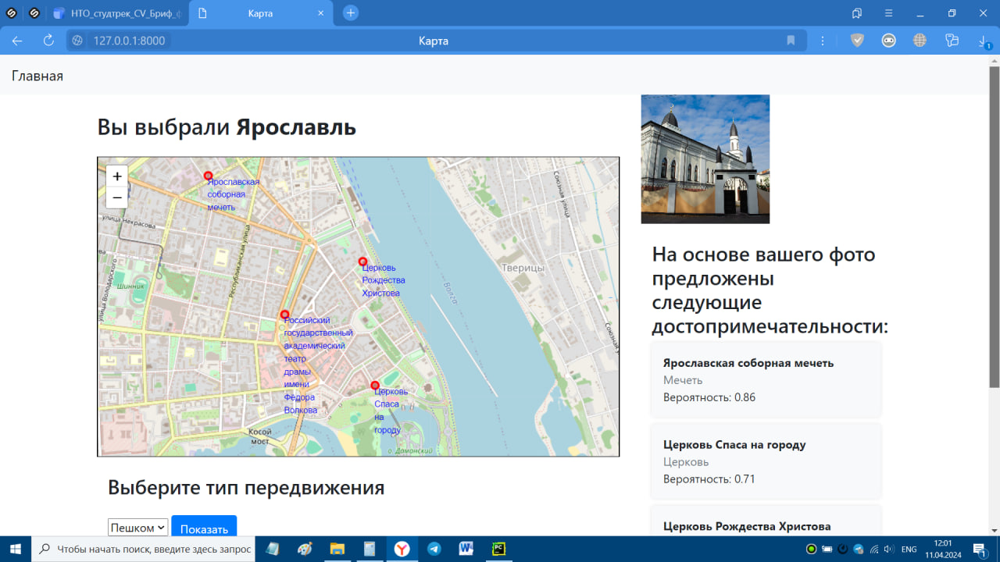
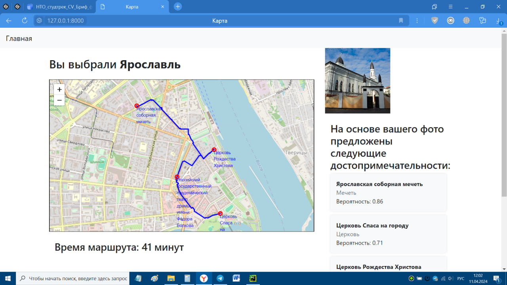
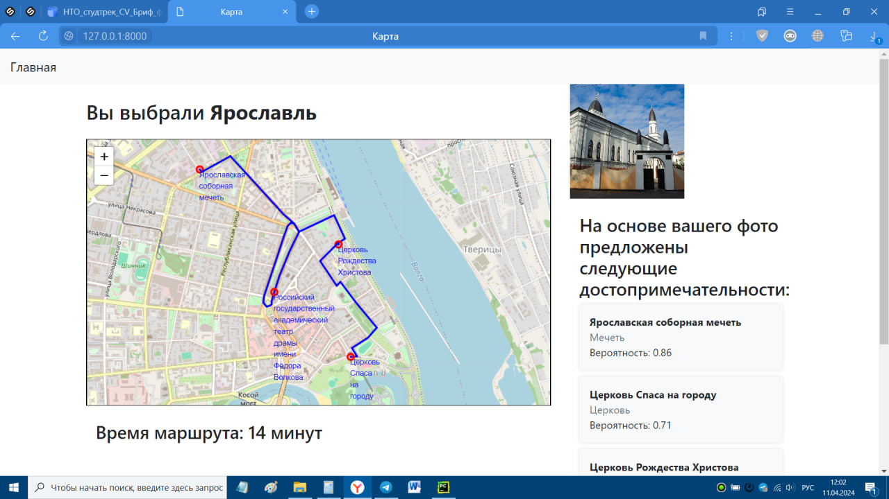

# Проект "Умный туристический помощник"

---

## Описание:

Проект "Карта достопримечательностей" представляет собой веб-приложение, 
которое позволяет пользователю получить список рекомендуемых к посещению достопримечательностей 
на основе выбранного города (Нижний Новогород / Ярославль / Владимир / Екатеринбург), 
введённого текстового описания места или изображения. Данные места отображаются на карте,
а также между ними может быть построен кратчайший маршрут: как пеший, так и автомобильный.

---

## Функциональность:

1. **Выбор города:** Пользователь может выбрать интересующий его город из списка доступных.
2. **Отображение карты:** После выбора города пользователю отображается карта с метками достопримечательностей данного города.
3. **Выбор типа передвижения:** Пользователь может выбрать один из двух типов передвижения (на автомобиле / пешком) для расчета маршрута до достопримечательностей.
4. **Расчет времени маршрута:** Приложение расчитывает время маршрута до достопримечательностей в зависимости от выбранного типа передвижения.
5. **Загрузка изображения:** Пользователь может загрузить изображение, и на основе этого изображения приложение предложит рекомендации о наиболее релевантных достопримечательностях.
6. **Отображение рекомендаций:** После загрузки изображения пользователь получает список рекомендуемых достопримечательностей с указанием их названия, категории и вероятности.

---

## Технологии:

- **Django:** Фреймворк Python для веб-разработки.
- **Bootstrap:** Фронтенд-фреймворк для разработки адаптивных и стильных интерфейсов.
- **HTML/CSS:** Языки разметки и стилей для создания пользовательского интерфейса.
- **PyTorch:** Фреймворк машинного обучения для языка Python с открытым исходным кодом, созданный на базе Torch.

---

## Архитектура сервиса


## Диаграмма Use-Case


---

## Установка:

1. Склонируйте репозиторий с помощью команды:

```git clone https://github.com/WocherZ/tourists_web_service.git ```

2. Перейдите в каталог проекта:

```cd tourists_web_service/application```

3. Установите зависимости:

```pip install -r requirements.txt```

4. Запустите локальный сервер:

```python manage.py runserver```

5. Откройте браузер и перейдите по адресу http://127.0.0.1:8000/ для доступа к приложению.

---

## Интерфейс
- Главная



- Форма



- Карта с точками



- Карта с построенным пешеходным маршрутом



- Карта с построенным автомобильным маршрутом

